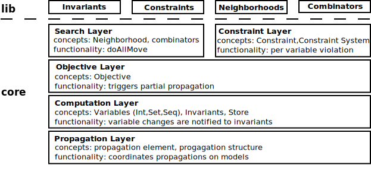

.. _oscar-cbls:

**********
OscaR-CBLS
**********

Learning Outcomes
=================

* Level 1: Beginning CBLS Modeler

  - can create a simple model, with a simple search based on one neighborhood
  - knows how modeling is organized (variables, invariants, constraints)
  - knows where to find invariants and constraints in the modeling API

* Level 2: Advanced CBLS Modeler

  - can create a search involving several neighborhoods and a global meta-heuristic
  - has a good intuition of how propagation works
  - knows about partial propagation and how to activate and control it

* Level 3: Expert CBLS Modeler

  - is able to extend the library of constraints and invariants
  - is able to extend the library of neighborhoods

Hello Queens (L1)
=================

Lots of tutorial in this field start with the same example that is the NQueen.
    This one will not make an exception. A simple NQueen is shown here:

.. literalinclude:: ../../oscar-cbls/src/main/examples/oscar/examples/cbls/userguide/NQueenBasic.scala
  :language: scala
  :linenos:
  :lines: 25-53

This model mixes with the trait  ``CBLSModel``.
This trait creates some structures and offers a set of methods to easily create your own solver.

More precisely, it offers the following features:
 - it defines an implicit Store (named ``s``) and ConstraintSystem (named ``c``) behind the scene. A store is what contains all the modeling of the optimization problem: variables, invariants, constraints. It coordinates the updates to the values of variables. Constraints are furthermore grouped into a constraint system that notably maintains the conjunction of the constraints.
 - it supports an API to create the three variable types supported by OScar.cbls, namely: Int,Set (of Int) and Sequences (of Int).
 - it also offers lots of methods to create every constraints or invariant of the problem you want to solve
 - it includes some linear selectors that you can use for defining our search procedure (see the ``selectMin`` method)
 - it proposes a set of standard neighborhoods, illustrated here below
 - it also includes high-level methods to create complex search procedures by means of combinators, illustrated in further sections

We show here below a more elaborate solver for the NQueen. Besides using a more elaborate search strategy,
that swaps queens where one of the swapped queen is among the one that cause teh most violation of the posted constraints.
It also relies on a standard neighborhood for implementing the search procedure.
It uses a standard ``swap`` neighborhood with problem-specific parameters that specifies what queen must be swapped with what other queen.

.. literalinclude:: ../../oscar-cbls/src/main/examples/oscar/examples/cbls/userguide/NQueenEasy.scala
   :language: scala
   :linenos:
   :lines: 33-55

Warehouse Location Example (L1)
===============================

A classical example in optimization is the warehouse location problem (WLP). The problem is as follows:

* **Given**
** S: set of stores that must be stocked by the warehouses
** W: set of potential warehouses
** Each warehouse has a fixed cost fw
** transportation cost from warehouse w to store s is cws
* **Find**
** O: subset of warehouses to open, Minimizing the sum of the fixed and the transportation cost.
** A store is assigned to its nearest open warehouse

The problem is solved in the following script:

.. literalinclude:: ../../oscar-cbls/src/main/examples/oscar/examples/cbls/userguide/WarehouseLocation.scala
:language: scala
       :linenos:
           :lines: 28-78

Gutts of OscaR.cbls (L3)
========================

Features of OscaR.cbls, for the impatient nerds
-----------------------------------------------

OscaR.cbls is an implementation of constraint-based local search.
It also features a high-level module to help you define your search procedure.

OscaR.cbls has the following features:
 - high-level modeling primitives with variables of types integer, set of integer, and sequence of integers
 - Partial propagation for fast neighborhood exploration. Propagation is triggered when the value of a variable is queried, typically the variable  is the objective function, and it is queried by the search procedure. Deciding whether the propagation will be total or partial is done depending on the variable: if the variable is registered for partial propagation, the propagation will be partial. It will be total otherwise. Violation degrees are automatically registered for fast propagation.
 - Propagation graph can be cyclic. Two propagation graphs are handled: a static graph that over-approximates the dependencies between variables and invariants, and a dynamic graph that represents the real dependencies given the data actually stored in the model. The static graph can include cycles. This makes it possible e.g. to implement JobShop scheduler from standard invariants.
 - Constraints assign violation degree to their input variables, to identify the variable that cause a violation of each constraint. The violation degree propagates upwards through the model, it enables one to find the variable contributing the more to the overall violation even if it is not directly subject to the constraint.
 - Libraries of standard invariants and constraints
 - A library of neighborhood for integer and sequence variables
 - A domain specific language for declaring search procedures by combining neighborhoods together. It also supports the cross-product of neighborhoods.

Architecture of OscaR.cbls
--------------------------

This section presents the architecture of OscaR.cbls.
The purpose of this section is to understand the nature of the concepts manipulated when using OscaR.cbls.

:scale: 50
    :width: 700
        :align: center
        :alt: Architecture of OscaR.cbls

    * **Propagation Layer** defines propagation graphs. Propagation is the very basic mechanism of OScaR: when the value of a decision variable changes, this change must be propagated to the model in some coordinated way. This layer takes care of the coordination.
* **Computation Layer** defines concepts such as variables and invariants and the three supported variable types (Int,Set, and Seq), and some additional mechanism called notification: Upon propagation, a variable notifies its listening invariants about its change.
* **Objective layer** defines the notion of objective function. An objective function is basically an integer variable that is automatically registered to the propagation layer for partial propagation.
* **Search Layer** defines an API for neighborhoods, moves and combinators
* **Constraint Layer** defines an API for constraint and constraint systems
* **Libraries** proposes libraries of constraints, invariants, search neighborhoods and combinators.
* **Business packages**: includes routing and scheduling extensions (scheduling is deprecated in spring 2018). These are special extensions that introduce additional structure on top of the proposed variables. Such libraries may include additional invariants, constraints, visualsation and neighborhoods

Modeling with OscaR.cbls (L1)
=============================

OscaR.cbls has two main modeling concepts: variables, and invariants.

OscaR.cbls natively supports three types of variables: integers, sets of integers and sequences of integers.
All data structure representing values of variable are non-mutable,
so that the value of a variable can be saved by simply copying a reference to its value (or the value itself in the case of an integer variable).

Invariants are mathematical operators that maintain the value of one or more variable
according to a set of inputs and according to their specification.
For instance, there is an invariant ``Sum2`` that has two input variables that are CBLSIntVar,
and maintain an output CBLSIntar to be the sum of the two input ones.
Invariants are directed, that is an instance of invariant has designated input and output variables.
There is a library of roughly eighty invariants available in OscaR.cbls.

There are a set of rather simple invariants, and some more complex ones, mainly on sequences that are so-called "global invariants".
Global invariants are called this way because tehy implement rather complex formulas, and make use of dedicated algorithm to implement them.
An example of such global invariant is the ConstantRoutingDistance invariant over vehicle routes.
Let be a variable of type CBLSSeqVar, representing the route of v vehicles.
The invariant ConstantRoutingDistance inputs this CBLSSeqVar and a distance matrix, and maintins an array of v CBLSIntVar to be the length of the route of each vehicle.

OscaR.cbls also supports constraints. They are specific objects that have two main features:
 1. they define a violation degree that is related to their specification it is moreless a distance between the current value of their input variable and an assignemnt for these variable that satisfies the constraints. Constraints are actually invariants with this violation as output variable.
 2. identify the input variable that contribute to their violation by attributing an individual violation degree to each of their input variables.

Constraint systems propose the same mechanism, except that they do not compute the violation for each and every variable that appears in the constraints that are posted into them. Instead, any variable can be registered into them for a violation degree. These include not only the variables that intervene in some constraint posted into them, but any variable of the model.
In a constraint system, the local violation degree of a variable is the sum of the violation degree attributed to it, for each constraint posted in the constraint system, weighted by the weighting factor of the constraint. Only variables that directly intervene in a constraint have a nonzero local violation degree. The \emph{global violation degree} of a variable is the sum of the local violation degrees of all variable that have one in the constraint system, and that contribute directly or indirectly to the variable, according to the static dependency graph. Global violation degrees are therefore built by constraint systems following a reachability query to the static propagation graph. This query is performed when the constraint system is closed, so that if the graph is enriched afterwards, these changes are not taken into account in the global violation degrees.

Propagation in OscaR.cbls (L1)
------------------------------

Propagation is the core mechanism in a CBLS engine. It is about updating the model according to changes made on the decision variables.
When exploring a neighborhood, decision variables are changed by the search procedure, and the objective function is then queried;
it is the propagation mechanism that ensures that the value of the objective function object is correct with respect to the value of the decision variable at that point.

The CBLS engine sees the model as a propagation graph. Roughly, it is a directed acyclic graph, whose nodes are variables, and invariants, and whose edges represent data flows.
there is an edge from a variable to an invariant if the variable is one of the input of the invariant,
and there is an edge from an invariant to a variable if the variable is controlled by the invariant; its value is set by the invariant).
In this graph, the nodes are called propagation elements technically, variables and invariant inherit from the "propagation element" class.

Propagation is fast thanks to the following properties:
* **Single wave**: when updates are propagated in the propagation graph, each node is reached at most once by the wave.
* **Selective**: a propagation element is reached by the propagation wave only if it requires performing some update. Portions of the propagation graph where no change was performed on the input will therefore not be reached by the propagation wave.
* **Locally incremental**:  invariants are designed to perform incremental update of the variable(s) they control. This is achieved by proposing as additional mechanism on top of the propagation process so that invariants are notified about specific change of their input variable(s).
* **Lazy**: propagation is triggered when a variable is queried, and if it is not an input variable. Querying an objective function will query the variable that defines the objective function
* **Partial**: when the propagation is triggered through han objective function, only the portion of the model that contributes to the objectif function is updated

Tip for the CP guys: In a CP engine, propagation is omnidirectional: the algorithms of constraints are triggered on change of any of their variable, and can update all of their variables.
In CBLS, invariants distinguish their input and output variables. They are triggered on change of their input variable, and can only update their output variables.
A variable can only the output of a single invariants. Due to the distinction between input and output, propagation in CBLS is a single wave that crosses the propagation DAG,
while in CP, it requires iterating until a fixpoint is reached.

Propagation is carried out by sorting the element in the propagation DAG with lower indices closer to the decision variables,
and higher indices closer to the objective function.
This sort is time consuming. It is performed when the model is closed through the *store.close* method.

Notification in Oscar.cbls (L3)
-------------------------------

On top of propagation, there is another mechanism, belonging to the computation layer. It is the notification mechanism.
When a variable is propagated, it updates its value, and notifies the new value to its listening invariants by calling a method called "notify"
in its listening invariants to notify about the change. Thanks to this mechanism, only the invariants that might need to react to some change are notified about a change.
There are specific methods for each type of variable, with specific parameters, but they mostly include the variable, its old value, and its new value, and a description of the delta.

Constraints (L1)
----------------

Is OscaR.cbls, constraints are specific objects that have two main features:
* compute their violation degree; thay are thus lagrangian relaxations
* identify the variable that contribute to their violation by attributing an individual violation degree to each of their input variables.

A constraint declares a set of constrained variables. These are the ones that intervene in the constraint. For each of them, the constraint must be able to provide a violation degree. This is an IntVar that computes to which extend the variable contributes to the violation of the constraint.
Constraint systems propose the same mechanism, except that they do not compute the violation for each and every variable that appears in the constraints that are posted into them. Instead, any variable can be registered into them for a violation degree. These include not only the variables that intervene in some constraint posted into them, but any variable of the model.
In a constraint system, the \emph{local violation degree} of a variable is the sum of the violation degree attributed to it, for each constraint posted in the constraint system, weighted by the weighting factor of the constraint. Only variables that directly intervene in a constraint have a nonzero local violation degree. The \emph{global violation degree} of a variable is the sum of the local violation degrees of all variable that have one in the constraint system, and that contribute directly or indirectly to the variable, according to the static dependency graph. Global violation degrees are therefore built by constraint systems following a reachability query to the static propagation graph. This query is performed when the constraint system is closed, so that if the graph is enriched afterwards, these changes are not taken into account in the global violation degrees.

Searching with OscaR.cbls
=========================

Searching with OscaR.cbls using standard neighborhoods and combinators (L1)
---------------------------------------------------------------------------

When developing a local search solution, one must specify a *search procedure*.
A search procedure specifies how the search will find a proper solution to the problem.

It is made of several components such as:
* **Neighborhoods** , which represent sets of ``close'' solutions that can be reached from the current solution in one *move*.
Neighborhoods can be compared on their varying efficiency, optimality, and connectivity. They can also be composed together to reach new trade-offs around these aspects.
* **Strategies** to escape from local minima, also called metaheuristics, such as tabu search, simulated annealing, random restart, etc.
* **Solution managers**, which allow us to store the best solution found during the search, and restore it when needed.
* **Stop criteria** to identify when the search will not find any more relevant solutions.

In our framework, a neighborhood is represented by a class instance that can be queried for a move,
given the current solution, an acceptance criterion, and an objective function.
Neighborhood queries return either the message **NoMoveFound** or the message **MoveFound(move,objAfter)** that carries a description of the move,
and the value of the objective function once the move will be committed. The returned move is expected to be acceptable with respect to the given acceptance criterion
and objective function. Querying a neighborhood for a move does not commit the move, although it requires a computational exploration of the neighborhood.
The global search loop repeatedly queries moves and commits them until some stopping criterion is met, or until no move can be found by the neighborhood.

The result of combining neighborhoods are still neighborhoods, offering this same API. The most intuitive combination of neighborhoods is \emph{``Best''}.
Let $a$ and $b$ be neighborhoods, the following statement is also a neighborhood (statements and code fragments are written in Scala \cite{scala}):

.. code-block:: scala
   :linenos:
    new Best(a,b)

When the combined neighborhood above is queried for a move, it queries both $a$ and $b$ for a move. It then returns the move having the lowest value for the objective function, according to the values carried by the returned moves. If a neighborhood cannot find a move, the overall result is given by the other neighborhood. If no neighborhood could find a move, the combined neighborhood does not find a move. Combinators are implemented in our framework as a DSL, enabling the use of a lighter infix notation. The above example can be rewritten as follows:

.. code-block:: scala
   :linenos:
    a best b

Building Complex Neighborhoods with Cross-Product of Neighborhoods (L2)
-----------------------------------------------------------------------

Let's consider $C$ the cross-product of neighbourhoods $A$ and $B$. It is built in source code as follows:

.. code-block:: scala
   :linenos:
    val C = A andThen B

The moves of $C$ are all the chaining between moves of $A$ and $B$.
Practically, $A$ and $B$ are not aware of each other, so that their implementation
does not need to be adapted to this setting. When neighbourhood $C$ is explored,
it explores neighbourhood $A$ and gives it an instrumented objective function
that triggers an exploration of $B$ every time it is evaluated by neighbourhood $A$.
This gives rise to search trees like the one illustrated in \reffig{fig:basicTree}
where $x$ is the current state where $C$ is explored, the edges labelled $a_1$ and $a_2$
represent moves of $A$, $x[a_1]$ represent the state $x$ after applying the move $a_1$,
and $x[a_1,b_1]$ represent the state $x[a_1]$ after applying the move $b_1$.

\begin{figure}[hb]
\centering
\begin{tikzpicture}
\node[draw,rounded corners=3pt] (x) at (-0.375,0) {x};
\node[draw,rounded corners=3pt] (x1) at (-2.5,-0.5) {$x[a_1]$};
\draw[->,>=latex] (x) -- (x1) node[midway,fill=white]{$a_1$};
\node[draw,rounded corners=3pt] (x11) at (-4,-2) {$x[a_1,b_1]$};
\node[draw,rounded corners=3pt] (x12) at (-2.5,-2) {$x[a_1,b_2]$};
\node[draw,rounded corners=3pt] (x13) at (-1,-2) {$x[a_1,b_3]$};
\draw[->,>=latex] (x1) -- (x11) node[midway,fill=white]{$b_1$};
\draw[->,>=latex] (x1) -- (x12) node[midway,fill=white]{$b_2$};
\draw[->,>=latex] (x1) -- (x13) node[midway,fill=white]{$b_3$};
\node[draw,rounded corners=3pt] (x2) at (1.75,-0.5) {$x[a_2]$};
\draw[->,>=latex] (x) -- (x2) node[midway,fill=white]{$a_2$};
\node[draw,rounded corners=3pt] (x21) at (1,-2) {$x[a_2,b_1]$};
\node[draw,rounded corners=3pt] (x22) at (2.5,-2) {$x[a_2,b_2]$};
\draw[->,>=latex] (x2) -- (x21) node[midway,fill=white]{$b_1$};
\draw[->,>=latex] (x2) -- (x22) node[midway,fill=white]{$b_2$};
\end{tikzpicture}
\caption{Exploration tree of neighbourhood $C$}
\label{fig:basicTree}
\end{figure}

An additional combinator was introduced to prune such search trees. Typically, when taking the cross-product of two neighbourhoods, the moves to be considered by the second one can be restricted according to the move currently explored by the first neighbourhood. Let's consider a pick-up \& delivery problem (PDP), and $A$ and $B$ are neighbourhoods that insert pick-up points and delivery points, respectively. We may typically wish to restrict the points to insert by $B$ to the delivery point that is related to the pick-up point that $A$ is trying to insert, and consider only position that occur after the position where $A$ is trying to insert. To this end, a \emph{dynAndThen} combinator was introduced. It is instantiated in source code as follows, where $a$ is the type of move explored by $A$:

\begin{lstlisting}
                  val D = A dynAndThen(a => B)
\end{lstlisting}

On the right-hand side of this combinator, the user specifies a function that inputs a move from $A$ and returns a neighbourhood $B$ to be explored once. This function is called by the combinator to generate a neighbourhood $B$ that is specific to each move of $A$. This function is the opportunity for the operational research developer to specify two things: First, the neighbourhood $B$ can be focused on relevant neighbours, as suggested above for the PDP. This can be specified to $B$ through parameters passed when instantiating it. Second, some pruning can be performed at this stage, such as checking the violation of some strong constraint. Consider a PDP with time window constraint (so a \emph{PDPTW}), we can check in this function that inserting the pick-up point does not violate any time window. If the time window constraint is violated at this stage, the search tree does not need to be explored further, so that the function can return null and the current move of $A$ is discarded. An example of insert neighbourhood for PDPTW built using the \verb+dynAndThen+ combinator and featuring some pruning is given below.

\begin{lstlisting}
val InsertPDP =
  insertPoint(nonRoutedPickupPoints, ...)
  dynAndThen((currentMove:InsertPointMove) =>
    if(timeWindowConstraint.violation == 0){
      insertPoint(relatedDelivery(currentMove.insertedPoint),
                  nodesAfter(currentMove.positionOfInsert),
                  ...)
    }else null)
\end{lstlisting}

Another very powerful combinator is the \emph{Mu} that roughly is the repetitive cross-product of a neighbourhood with itself with a maximal number of cross products:
\begin{lstlisting}
Mu(A,d) = A andThen A andThen A andThen ...       //"d" times
\end{lstlisting}
More elaborated version of this combinator are available and make it possible to share information between explorations of $A$ like the \verb+dynAndThen+.
