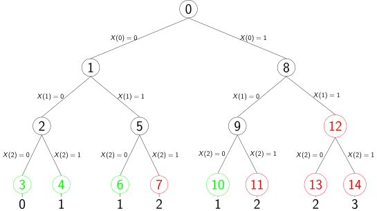
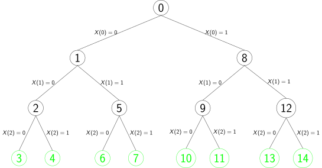
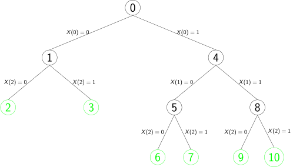
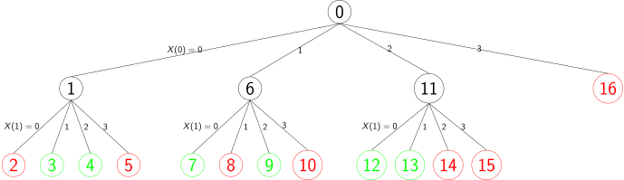
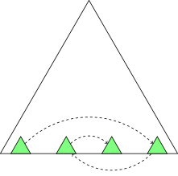

.. _oscar-cp:


******************************
OscaR-CP
******************************


Learning Outcomes
=======================================

* Level 1: Beginning CP Modeler
  
  - can create a simple model, using a default search
  - knows some important basic global constraints
  - can create an optimization model
  - can use reified constraints
  - can debug a model and measure its efficiency
  - can create a basic search heuristic (variable + value heuristic)


* Level 2: Advanced CP Modeler

  - can create a custom search
  - can create simple global constraint
  - has a good intuition of how propagation works
  - understand the different level of propagation
  - can use large neighborhood search to make CP scale
  - knows how to use the scheduling global constraints
  
* Level 3: Expert CP Modeler

  - is able to extend the library
  - can create a global constraint with incremental changes and state
  - can manipulate the trail and reversible objects
  - understand the search mechanism
  - understand some architecture and design choices of OscaR-CP
 
      + domain representation
      + trailing mechanism: implement your own reversible
      + reversible node
  - can solve multi-objective optimization problems
  - can use variable objective large neighborhood search
 

Create basic models (L1)
===================================================

Declare a solver, create variables, add constraints
-------------------------------------------------------

A first basic model is given next and commented after.

.. literalinclude:: ../../oscar-cp/src/main/examples/oscar/examples/cp/userguide/BasicModel.scala  
   :language: scala
   :linenos:    
  
  
     
This model mix with the trait  ``CPModel ``. This trait behind the scene defines an implicit CPSolver for you allowing you:

* to create all variables (attached to this solver) and also 
* to add every constraints of the problem you want to solve

You might view this object as the one containing all the info about your model (or more simply it is your model).
Note the different ways to create the variables and their initial domains. You can either give explicitly the set of valid values (a Scala Set) or you can give a range as argument of the variable creation.

In OscaR each time you add a constraint with the method add you trigger the fix-point algorithm so that you can see immediately the effect of propagation when adding this constraint (with interleaved  ``println `` for instance).

On the next example we use a binary-first fail depth first search on the array of variables [x1,x2,x3].

The start(nSols = 1) is asking to start the search and stop as soon as the first solution is discovered. 
To find all the solutions, you can simply use  ``start() `` which is equivalent to  ``start(nSols = Int.MaxValue) ``.
Each time a solution is found during the search tree exploration, the closure defined in onSolution(...) is executed. In this case, we just showing the value of x1 in the solution.


Add an Objective function
--------------------------

The next simple model defines an objective function to maximize.

.. literalinclude:: ../../oscar-cp/src/main/examples/oscar/examples/cp/userguide/BasicOptimizationModel.scala  
   :language: scala
   :linenos:    
  
The start will then use a branch and bound depth first search. The onSolution block will be called each time an improved solution is discovered.
The last solution found is the proven optimal one.


Using the Search
=========================

The ``search{ ... }`` block expects a ``Branching`` object or a closure that defines a custom search (see :ref:`custom-search`).
OscaR comes with some predefined ``Branching`` objects that can easily be used to solve your model.
The default behavior of most of them can be modified by replacing some code place holders.

Predefined Searches(L1)
------------------------

Next fragment illustrates 4 different predefined searches that can be used to assign a vector of variables ``X``.
Each of them will involve a different behavior of the search. In this case all result in a binary search tree 
with the variable and value selection strategy that differs.
As can be seen closures parameters allows you to override the default variable and value heuristic
based on the index of the variable.

.. literalinclude:: ../../oscar-cp/src/main/examples/oscar/examples/cp/userguide/PredefinedSearches.scala  
   :language: scala
   :linenos:  
   :lines: 18-20,26-28,34-36,42-44


If you hesitate with different searches, we recommend using ``conflictOrderingSearch`` that has been demonstrated efficient on a large variety of problems.

.. [COS2015] Conflict Ordering Search for Scheduling Problems, Steven Gay, Renaud Hartert, Christophe Lecoutre, Pierre Schaus, 2005

The complete example solving a same problem 4 times with here above defined searches is given next:

.. literalinclude:: ../../oscar-cp/src/main/examples/oscar/examples/cp/userguide/PredefinedSearches.scala  
   :language: scala
   :linenos:    
   


   


Specify limits on the search (L1)
---------------------------------

The start method takes possible 3 integer arguments to specify a limit on the search:

1. ``nSols`` the maximum number of solution to find before stopping
2. ``failureLimit`` a maximum number of failure (backtrack) before stopping
3. ``timeLimit`` a maximum number of seconds before stopping

All these values are set to ``Int.MaxValue`` if not specified.
If more than one limit is specified, the search stops when the first limit is reached.
Here is an example stopping the search after 4 seconds.

Alternatively you can also define a predicate that will stop the search when evaluated to true.
In next example the search is stopped after 5 solutions have been found.


.. literalinclude:: ../../oscar-cp/src/main/examples/oscar/examples/cp/userguide/SearchLimit.scala  
   :language: scala
   :linenos:   
   

Limited Discrepancy Search (L2)
--------------------------------

When you are confident that your search heuristic is good at discovering solutions, you can limit the maximum number of discrepancies (right decisions). 
The top-level decisions are generally quite uninformed since the problem is not yet very constrained in these search node.
The idea of limiting the discrepancy is to give a chance to reconsider these top-level decisions in the search.
For instance the next search tree cuts-off nodes with a discrepancy >= 1 (the discrepancy of leaf nodes are given at the bottom):




You can limit the discrepancy of the search with the ``maxDiscrepancy`` argument as shown on next example.
If you don't want to sacrifice completeness, you can still gradually increase the maximum allowed discrepancy inside a loop.

.. literalinclude:: ../../oscar-cp/src/main/examples/oscar/examples/cp/userguide/LimitedDiscrepancy.scala  
   :language: scala
   :linenos:
   


.. _custom-search:

Custom Search (L2)
=============================

OscaR CP gives you a lot of control to explore the search tree. 

Binary search
-------------- 

In order to define a custom search, you have to describe a procedure able to generate child nodes under a given node. A child node definition is simply a block of code (a Scala closure) to be executed to go into a particular child node. This block of code in constraint programming typically adds some constraint(s). In OscaR we call such a block an ``Alternative``.


Let us show a small example to illustrate the search in OscaR.
Assume we want to define this binary search tree:




Since the search tree is binary, you can use the ``branch`` to capture the block of code to execute in the left and right branch. This is done as follows:


.. literalinclude:: ../../oscar-cp/src/main/examples/oscar/examples/cp/userguide/BinarySearch.scala  
   :language: scala
   :linenos:    
   
   
   
``X.find(!_.isBound)`` asks for the first not yet bound variable in ``X``. If no such variable exists, we simply return ``noAlternative`` to say that there are no more child nodes under the current node. It also means the current node is a solution. In case we found some unbound variable ``x`` :math:`\in` ``X``, two child nodes are created with the instruction ``branch``, on the left child node this variable is assigned to ``0``, on the right it is assigned to ``1``. The ``branch`` instruction takes two blocks of code in argument:

1. The left block is executed each time the search goes on the left.
2. The right block is executed on the right decisions.


By default the search tree is explored in a DFS order.
 ``start()`` returns an object capturing some statistics on the past search. This object is used to print the number of solutions at the end.


The outcome of this program is:

and the output is:

.. code-block:: bash
	
   false,true,false
   false,true,true
   true,false,false
   true,false,true
   true,true,false
   true,true,true
   #solutions: 6


The search tree explored by this fragment is the following:




As can be seen, the last branch ``x(1)=0`` has been cutoff. The reason is that when ``add(x(1) == 0)`` is executed after ``add(x(0) == 0)``, the constraint
of our model ``x(0) || x(1)`` is clearly violated and the search automatically backtracks.
Note that all the constraints added inside a ``branch`` instruction are reversible. It means that their effect is cancelled when backtracking.

N-ary search
-------------- 
   
It is also possible to create more than two branches at each node.
The next program creates 4 children at each node of the search tree with the ``branchAll`` method.
This method asks for:

1. A collection to iterate on (it can simply be a range). The size of the collection determines the number of children.
2. A function that is called on each argument of the collection as the action block to be executed when creating the corresponding child node.

Next example illustrates the usage of ``branchAll``. We also added some constraints such that some branches are pruned.

.. literalinclude:: ../../oscar-cp/src/main/examples/oscar/examples/cp/userguide/NarySearch.scala  
   :language: scala
   :linenos:  
   
   
The search tree explored with the above program is the following:
   


  

A custom first fail
------------------------


The search heuristic is generally applied in two steps:

1. The variable selection: which variable to assign next in the children of the node.
2. The value ordering: in what order should the values be tried in children nodes. In DFS (the usual search in CP) we generally try to chose the most promising value in the left most child node.

These two choices constitute the **variable-value** heuristic. 
One of the most popular heuristic is  **first fail** principle trying to heuristically minimize the size of the sub-tree rooted in the current node if no solutions exists there.

One instantiation of this principle on a vector of decision variables *x* consists of selecting as the next variable to branch on, the not instantiated one with the smallest domain size. 

On the left branch we can for instance attempt to instantiate the variable to its smallest possible value and on the right branch we can force it to take a different value (binary search tree). Here is a procedure implementing this strategy


.. literalinclude:: ../../oscar-cp/src/main/examples/oscar/examples/cp/userguide/FirstFailSearch.scala  
   :language: scala
   :linenos: 


Adding Constraints to the model (L1)
=====================================

You can add a constraint (an object of type ``oscar.cp.core.Constraint``) to the model either using ``add`` or ``post`` method (on an implicit ``CPSolver`` object). The ``add`` throws an exception during the modeling if the model is inconsistent, while the ``post`` does not. If you are using ``post``, you can check if the model becomes inconsistent with the ``isFailed()`` method. Also the ``post`` method returns a ``CPOutcome.Failure`` if the solver is in a failed state. 

.. code-block:: scala
   :linenos:
   
   import oscar.cp._

   object MyModel extends CPModel with App {

     add(someConstraint) // NoSolutionException may be thrown
     
     val failed = post(someConstraint) == Failure // you can also check the consistency with solver.isFailed
   }

Every call to ``add`` or ``post`` methods triggers the fix point algorithm. It allows you to observe immediately the propagation effect. Don't hesitate to print the domains of your model after each ``add`` to debug it.

Filtering level(L2)
---------------------

For some constraints, several filtering strengths are possible. Remember that behind each constraint, a filtering algorithm is implemented (also called a **propagator**).


For some filtering algorithms, it is possible to characterize properly what the filtering it is doing.


Let :math:`C` be a constraint on the variables :math:`x_1, . . . , x_k` with respective domains :math:`D(x_1), . . . , D(x_k)`.
That is, :math:`C \subseteq D(x_1) \times \ldots \times D(x_k)`.


Domain-Consistency (also called Arc-Consistency)
    A constraint is domain consistent if every value in each domain can be extended to a solution. 
    More exactly, we say that :math:`C` is arc consistent if for every :math:`1 \le i \le k` and :math:`v \in D(x_i)`, there exists a tuple :math:`(d_1,\ldots,d_k) \in C` such that :math:`d_i  = v` and :math:`\forall j \neq i: d_j \in D(x_j)`.     

Bound-Consistency 
    A constraint is bound-consistent if every bound can be extended to a solution considering interval domains (without holes). 
    More exactly, we say that :math:`C` is bound consistent if for every :math:`1 \le i \le k`, there exists a tuple :math:`(d_1,\ldots,d_k) \in C` such that :math:`d_i = \min(D(x_i))` and :math:`\forall j \neq i: d_j \in [\min(D(x_j))..\max(D(x_j))]`, and there exists a tuple :math:`(e_1,...,e_k) \in C` such that :math:`e_i = \max(D(x_i))` and :math:`\forall j \neq i: e_j \in [\min(D(x_j))..\max(D(x_j))]`.


Thus a filtering algorithm achieving bound-consistency shrinks the domain intervals as much as possible (without losing any solutions) while an algorithm achieving domain consistency removes all possible inconsistent values (possible in the middle of the domains).

For many constraints, reaching domain or bound-consistency is too expensive (sometimes NP-Complete).
In this case, faster filtering algorithms are preferred but unfortunately it is not always possible to characterize properly the consistency level they can reach.


The stronger the filtering, the more expensive (time complexity) is each execution of the propagator inside the fix-point algorithm.
The experimented users can play with the strength of filtering. 
Three filtering strengths are available:

1. ``Weak``
2. ``Medium`` (the default)
3. ``Strong``

For some hypothetical constraint, one could for instance have that ``Strong`` asks for domain-consistency while ``Medium`` asks for bound-consistency  filtering .

This can be specified with the ``add/post`` method:

.. code-block:: scala
   :linenos:
   
   import oscar.cp._

   object MyModel extends CPModel with App {
     
     add(someConstraint, Strong)
     
   }


Sometimes it pays off to activate more sophisticated filtering algorithms, able to remove more inconsistent values.
If a constraint proposes several level of filtering strength, these should be specified in the OscaR `Scaladoc 
<http://jenkins2.info.ucl.ac.be/job/oscar-dev/javadoc/#oscar.cp.modeling.Constraints>`_.


Expressions and simple constraints (L1)
=========================================

OscaR-CP does not have expression objects that can be manipulated or simplified automatically by the solver.
Instead it provides some operator overloads that allow you to model easily (almost as if expressions where available).


Binary Relation Constraints (L1)
----------------------------------

OscaR supports binary relation constraints ``<,>,<=,>=,==``.
These relations are just operator overloads methods defined on ``CPIntVar`` objects. Each of these methods return the corresponding constraint.

Arithmetic Constraints (L1)
------------------------------

Supported binary arithmetic constraints  are ``+,-,*``.

Example
   Consider ``add(x+y-x > 0)``. This constraint is not simplified into ``y > 0``.
   Instead ``x+y`` returns a variable ``w`` linked with with the constraint ``x+y=w`` added to the model for you.
   Then ``w-x`` return a variable ``z`` linked with ``w-x=z``. Finally ``z > 0`` returns a binary constraint added to the model. 


Arithmetic constraints with integer operand must occur on the right of the operator (i.e.  write ``x+1`` instead of ``1+x``).


Since it is common to write summations over a large number of variables (like :math:`\sum_i x_i`), OscaR has special constructs for that.
There is also modeling constructs to sum over 2 indices.
You can take the **negation** of a variable or its **absolute value**. This returns a fresh variable linked with the previous one by the appropriate constraint.
An example of usage of these constructs is given next:

.. literalinclude:: ../../oscar-cp/src/main/examples/oscar/examples/cp/userguide/ArithmeticConstraints.scala  
   :language: scala
   :linenos:  


You can also use scala constructs combined with ``+`` (``for yield, reduceLeft, foldLeft``, etc.)


Reified and logical constraints (L1)
--------------------------------------

One main asset of CP is its ability to model logical constraints easily. By logical constraints, we mean constraints between ``CPBoolVar``. A ``CPBoolVar`` is nothing else than 0-1 ``CPIntVar`` variable with 0 representing false, and 1 representing true.
Notice that as the ``CPBoolVar`` class extends the ``CPIntVar``, it can be used anywhere a ``CPIntVar`` is expected.

OscaR support the logical or "||", the logical and "&&" and the implication "==>".

When you express logical constraint between boolean variables, the result is a fresh boolean variable (for instance ``b1 || b2``). Since it is very common to constrain a boolean expression to be *true*, you can add a boolean variable directly to the model which is implicitly constrained to be true.
You can also build logical complex boolean expressions using the logical operators (&&,||,==>) such as in following
This is illustrated on next example:


.. literalinclude:: ../../oscar-cp/src/main/examples/oscar/examples/cp/userguide/Logical.scala  
   :language: scala
   :linenos:  


   
A very useful tool to model logical constraints are the reified constraints. Reified constraints are nothing else than constraints that can be negated (Note that logical constraints are reified constraints themselves since they return a CPBoolVar that you can constrain to be false). Standard reified relation constraints are also present in OscaR:

* ``<==`` is the reified less or equal, 
* ``<<=`` is the reified strictly less than,
* ``===`` is reified equality.

For instance you could count the number of variables taking a value between 2 and 3 (inclusive) as follows:  

.. literalinclude:: ../../oscar-cp/src/main/examples/oscar/examples/cp/userguide/Reified.scala  
   :language: scala
   :linenos:  


   
``count`` is a CPIntVar representing the number of variables in ``X`` taking its value in the interval [2..3]: 

* The result of ``X(i) >==2`` is a ``CPBoolVar`` (0-1) variable equal to true (1) if and only if X is larger or equal to 2. 
* The result of ``X(i) <<=4`` is a ``CPBoolVar`` (0-1) variable equal to true (1) if and only if X is strictly smaller than 4. 
* The ``&&`` between the two ``CPBoolVar``'s is true (1) only if both are equal to true. 
* Then a variable is returned by the sum function representing the summation of the 5 CPBoolVar's  


Element Constraints (indexing array with variable) (L1)
--------------------------------------------------------

CP allows you to index an array of integers or of variables with another variable. This is called **element** constraints.
You can model with such constraints naturally using standard Scala array accessors:


.. literalinclude:: ../../oscar-cp/src/main/examples/oscar/examples/cp/userguide/Element.scala  
   :language: scala
   :linenos: 


In the above example ``x(y)`` and ``w(y)`` both returns a ``CPIntVar``.

You can also access 2D arrays of constants with two index variables as shown by indexing ``matrix`` with ``y1`` and ``y2``.


Global Constraints (L1-L2)
===========================

A global constraint is a constraint having potentially more than two variables in its scope. 
A global constraint generally offers a better filtering than a decomposition of this one into simpler constraints:

* A better speed efficiency, and/or
* A stronger filtering, generally able to remove more values.

Using global constraints when possible also permits to write more readable and maintainable CP models.
Any good CP modeler should:

1. know the important global constraints available in the solver and  
2. be able to recognize when they can be used (more an art than a science). 


The global constraints available into OscaR are all listed and documented in the `Constraints 
<http://jenkins2.info.ucl.ac.be/job/oscar-dev/javadoc/#oscar.cp.modeling.Constraints>`_ trait.
The description of each of them is out of scope of this document but an advanced user should be familiar
with most of them. Indeed using them can drastically impact the solving time.

Implement your own constraint (L3)
===================================

A new constraint can be implemented either in Java or in Scala but for this explanation we will consider a Scala implementation. 
A CP constraint has two responsibilities during the solving proces:

1. Check that it is consistent according to it's definition
2. Remove inconsistent values from the domain of it's scope

To implement a constraint you have to extend the Constraint_ abstract class. The minimum requirement is to override those two methods:

.. _Constraint: http://jenkins2.info.ucl.ac.be/job/oscar-dev/javadoc/#oscar.cp.core.Constraint

* ``def setup (l: CPPropagStrength): CPOutcome`` This method is in charge of checking if the constraint is consistent according 
    to it's semantic and the current domains and it can also do first propagation to remove inconsistent values. 
    It is also in this method that you register the constraint to potential modification of the domain of the variables in its scope.
* ``def propagate (): CPOutcome`` This method will be called when a domain of a variable has been modified and so the constraint 
    can potentially remove new inconsistent values there or detect it is inconsistent.
    
Both method return a CPOutcome value which can be:

* ``CPOutcome.Failure``: you return this to tell to the solver that the constraint is inconsistent and that a backtrack should occur.
* ``CPOutcome.Success``: you return this to tell to the solver that the constraint will always be satisfied if the domain reduces even more whatever the reduction.
* ``CPOutcome.Suspend``: you return this to tell to the solver that the constraint has done its work but if something changes, it wants to be called back again.


Less or equal constraint
-------------------------

This constraint asks that a variable X should be less or equal <= than another variable Y. 
Let us call our constraint MyLessOrEqual defined in next example.

.. literalinclude:: ../../oscar-cp/src/main/examples/oscar/examples/cp/userguide/SimpleUserConstraint.scala  
   :language: scala
   :linenos: 
   
   
Let's explain each line of the propagate method first:

* Clearly if the minimum value in the domain of Y is already larger or equal 
  than the max of the domain of X, whatever values are removed from both domain in the 
  future will not affect the fact that the constraint will always be satisfied. 
  This is why we return CPOutcome.Success in this case.
* Every values of the domain of Y smaller than the minimum of X are inconsistent. 
  This is why we set the minimum of the domain of Y to the minimum of the domain of X using 
  the method ``updateMin```. This method directly impact the domain of Y and could potentially make it empty. 
  In case it becomes empty, updateMin returns ``CPOutcome.Failure``` and we must also report 
  this failure as the result of our propagate method.
* The next case is symmetrical wrt to X
* Finally if none of the previous cases are true, it means that we are still interested to 
  be called later if something changes on the domain of X or Y.   
  
  
In the   ``setup()`` method we ask that the ``propagate`` method is called when a bound of either X or  Y changes.


Large Neighborhood Search (L2)
================================


LNS is a technique to solve difficult optimization problems with Constraint Programming. 
The goal of LNS is to avoid being stuck in a region of the search tree for too long by 
restarting frequently to explore other regions. 
In a huge search tree the early decisions are never reconsidered and all the time is spent searching in only one small region of the search space.
This phenomenon is illustrated on the next figure where only the small green triangle is explored within the allowed computation time.


With LNS when you realize that the search is stuck for too long, it restarts and visits another place of the search space.
The search space explored is thus more similar:



The principle is the following:

* Keep a current best solution to your problem, repeat the following two steps (relax + restart) until a stopping criteria is met.
* relax: relax the current best solution (typically by fixing only a fraction of the decision variables to their value in the current best solution)
* restart: Try to improve the current best solution with CP and replace it if a better solution can be found. This restart has a limited number of failures

   

.. [SHAW98] Using Constraint Programming and Local Search Methods to Solve Vehicle Routing Problems, Paul Shaw, 1998


Next section illustrates how to do that on a quadratic assignment problem:

There are a set of n facilities and a set of n locations. For each pair of locations, a distance is specified and for each pair of facilities a weight or flow is specified (e.g., the amount of supplies transported between the two facilities). The problem is to assign all facilities to different locations with the goal of minimizing the sum of the distances multiplied by the corresponding flows.
 
*There are a set of n facilities and a set of n locations. For each pair of locations, a distance is specified and 
for each pair of facilities a weight or flow is specified (e.g., the amount of supplies transported between the two facilities). 
The problem is to assign all facilities to different locations with the goal of minimizing the sum of the distances 
multiplied by the corresponding flows.*

.. literalinclude:: ../../oscar-cp/src/main/examples/oscar/examples/cp/userguide/QuadraticAssignment.scala  
   :language: scala
   :linenos: 
   

The first step to transform this model into a LNS model is keep track of the best current solution in ``bestSol`` array:   
Our lns relaxation procedure that will randomly restore 50% of the variables to their value in the current best solution:  
We can now implement the 100 restarts and each restart have a limit of at most 1000 failures. We do that in a simple 
``for`` loop and use the method ``startSubjectTo`` to make a new run. 
Note that constraints added in the ``startSubjectTo`` block are reverted at each new run.

.. literalinclude:: ../../oscar-cp/src/main/examples/oscar/examples/cp/userguide/QuadraticAssignmentLNS.scala  
   :language: scala
   :linenos: 


   

